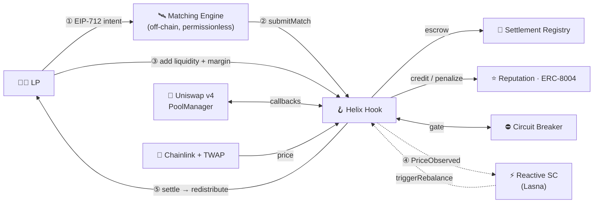

<!-- ============================== HERO ============================== -->
<div align="center">


### Cross‑Pool Hedging Router with Reactive Auto‑Rebalancing for Uniswap v4

**LPs sign intents → get matched into correlation‑diversified baskets → and at settlement the unlucky are compensated by the lucky.**
<br/>Zero‑sum · self‑funded from margins · no insurance fund · no perps · no operator · LP capital never leaves Uniswap.

<br/>

[](https://youtu.be/9TxX2zQ2xMo)
[](https://helix-ui-five.vercel.app)
[](https://sepolia.etherscan.io/address/0x6704c3F3FeF5F7596E68470B3430b14b8c99d640)

[](https://github.com/aliveevie/helix/actions/workflows/ci.yml)


</div>

<!-- ============================== QUICK LINKS ============================== -->
<table align="center">
<tr>
<td align="center">🎬<br/><b><a href="https://youtu.be/9TxX2zQ2xMo">Demo Video</a></b></td>
<td align="center">⚡<br/><b><a href="https://helix-ui-five.vercel.app">Live App</a></b></td>
<td align="center">⛓<br/><b><a href="https://sepolia.etherscan.io/address/0x6704c3F3FeF5F7596E68470B3430b14b8c99d640">Hook (Sepolia)</a></b></td>
<td align="center">📜<br/><b><a href="deployments/sepolia.json">All Addresses</a></b></td>
<td align="center">🗣<br/><b><a href="docs/slides-format.md">Pitch Deck</a></b></td>
</tr>
</table>

---

## ✦ The thirty‑second version

Every Uniswap liquidity provider absorbs **impermanent loss** alone, and the tools to hedge it — perps, options, capitalized insurance funds — are heavy, custodial, or require a token to trust. **Helix is a Uniswap v4 hook that lets LPs pool that risk like mutual insurance.**

You sign an off‑chain **EIP‑712 intent**; a permissionless engine matches you with others into a **basket**; the hook tracks each member's IL over an epoch and, at settlement, **redistributes value so everyone converges toward the basket's capital‑weighted average IL.** It is **zero‑sum within the basket and self‑funded from posted margins** — there is no treasury, no perpetual, no privileged operator, and your liquidity never leaves the Uniswap pool.

<div align="center">

> **Ex‑ante — before you know whether you'll be the lucky or the unlucky LP —<br/>pooling cuts your expected IL variance by a measured 40–54%.**

</div>

---

## ✦ Seeing it work

**The value loop, with real numbers** &nbsp;·&nbsp; `forge test --match-contract Showcase -vv`
<br/>Three LPs enter the same pool at wildly different prices, so their impermanent loss is wildly dispersed — then ρ‑mutualization converges every one of them to the basket average, conservation‑checked on‑chain to the wei:

```text
  LP      entry price     standalone IL          after pooling (ρ = 1)
  ───     ───────────     ────────────────       ─────────────────────
   A         1.00          0.45 %    ┐
   B         2.00          2.54 %    ┝━━━━━━━━━━▶   all three:  6.02 %
   C         0.50         15.08 %    ┘
  ──────────────────────────────────────────────────────────────────
  IL‑rate variance across members:   417,396  ──▶  0     (eliminated)
  on‑chain settle():                 payouts == margins  (conservation holds)
```

**Against the real Uniswap v4 PoolManager** &nbsp;·&nbsp; `FORK_RPC_URL=<sepolia> forge test --match-test test_fork_fullLifecycleAgainstRealV4 -vv`
<br/>Forks Sepolia and runs the **entire lifecycle** — `initialize → afterAddLiquidity → swap → settle` — against the canonical v4 `PoolManager` at [`0xE03A1074…3543`](https://sepolia.etherscan.io/address/0xE03A1074c86CFeDd5C142C4F04F1a1536e203543). The hook is load‑bearing on actual Uniswap, not a mock.

---

## ✦ How it works

<div align="center">



</div>

| Step | What happens | Enforcement |
| :--: | :-- | :-- |
| **① Intent** | LP signs an EIP‑712 intent: pool, max drift, size, duration, reputation floor. | Off‑chain, gasless. |
| **② submitMatch** | Anyone submits a basket of signed intents. | The hook **re‑verifies every signature, nonce, deadline and constraint on‑chain** — a malicious engine can only produce matches the hook rejects. |
| **③ Enter** | `afterAddLiquidity` snapshots the position and escrows a settlement margin. | Margin sized from the basket's worst‑case drift. |
| **④ Monitor** | `afterSwap` updates a pool TWAP + feeds the volatility breaker; a Reactive contract watches volatility & correlation. | Authenticated `triggerRebalance` callbacks (PAUSE / RESUME / RE‑MATCH). |
| **⑤ Settle** | After the epoch, **anyone** settles; IL is computed, redistributed, and a bounded settler fee is paid. | Permissionless & incentivized — no operator. |

---

## ✦ The accounting — zero‑sum by construction

For a basket with capital weights `wᵢ = sizeᵢ / Σsize` and mutualization coefficient `ρ ∈ [0,1]`:

```text
  ILᵢ           =  V_hold(P₁) − V_pool(P₁)         (≥ 0, per member)
  IL_fairᵢ      =  wᵢ · Σ ILⱼ                       (capital-weighted fair share)
  adjustmentᵢ   =  ρ · (ILᵢ − IL_fairᵢ)             (worse-than-fair ⇒ receives)
  ────────────────────────────────────────────────────────────────────────────
  Σ adjustmentᵢ =  0                                (exactly — self-funded)
```

- **ρ is the dial.** ρ = 1 → every member realizes the basket average; ρ < 1 → members keep skin in the game.
- **Solvency‑bounded.** At settlement ρ is capped to the posted margins, so a settlement **can never under‑fund a member** — proven under fuzzing, including across cross‑pool baskets.

---

## ✦ Cross‑pool: hedge across assets, not just timing

A basket can span **multiple pools** — each member priced at its **own** pool, mutualized together. The matching engine uses a **live correlation matrix** to pair *anti‑correlated* assets:

```text
  Cross-pool baskets (correlation-diversified, hedging across assets)
  ───────────────────────────────────────────────────────────────────
   ETH/USDC  +  ARB/USDC     diversification score  46.8   ← strong hedge
   WBTC/USDC +  ARB/USDC     diversification score  46.2
   ETH/USDC  +  WBTC/USDC    diversification score   2.9   ← move together
```

> A **real cross‑pool basket** spanning ETH/USDC + ARB/USDC is **live on‑chain** — one match, two pools:
> [`submitMatch` tx](https://sepolia.etherscan.io/tx/0x3daa7796c0333002390db5aa339549726b7430bda1bcecdb70f6d5066235339b) · `getMatch().pools` returns two distinct pool IDs.

---

## ✦ Architecture — four planes, one hook

- **Liquidity** — canonical Uniswap v4 pools. *Helix never moves LP capital.*
- **Accounting** — `HelixHook`, `SettlementRegistry`, and an **ERC‑8004** `ReputationAccumulator`.
- **Control** — a hysteresis `CircuitBreaker` + a **Reactive Network** contract monitoring volatility / correlation.
- **Coordination** — the off‑chain matching engine + SDK. *No on‑chain authority.*
- Prices **cross‑check Chainlink against the pool TWAP** and reject settlement on divergence.

### Integrations — real, not name‑dropped

<table>
<tr>
<td width="25%" align="center">🦄<br/><b>Uniswap v4</b><br/><sub>load-bearing hook;<br/>full lifecycle vs the real PoolManager</sub></td>
<td width="25%" align="center">🔗<br/><b>Chainlink</b><br/><sub>live <code>ChainlinkOracle</code><br/>reading the real ETH/USD feed</sub></td>
<td width="25%" align="center">⭐<br/><b>ERC‑8004</b><br/><sub>conformant reputation registry:<br/>tagged, revocable feedback</sub></td>
<td width="25%" align="center">⚡<br/><b>Reactive</b><br/><sub>live RSC on Lasna, subscribed;<br/>callbacks authorized on Sepolia</sub></td>
</tr>
</table>

---

## ✦ Safety — guarantees, not hopes

| Invariant | Guarantee | Where |
| :-- | :-- | :-- |
| **Conservation** | payouts never exceed escrowed margins | `test/invariant` (16,384 calls), `test/fuzz` |
| **Exact zero‑sum** | `Σ adjustments == 0`, all inputs | `test/unit/MathUnit` |
| **Settlement solvency** | ρ bounded to margins — `settle()` never under‑funds | `test/fuzz` (worst‑corner + fuzz) |
| **Idempotency** | a `SETTLED` match cannot re‑settle | `test/invariant` |
| **Cross‑pool safety** | conservation & solvency hold across pools | `test/invariant` (~2,700 cross‑pool sequences) |
| **Oracle resistance** | revert on Chainlink ↔ TWAP divergence | `test/unit/ControlPlane` |
| **Reactive loop (E2E)** | hook's real events → RSC → real callback bytes → pause/resume | `test/integration/ReactiveLoop` |

<div align="center">

**41 Foundry tests** (unit · fuzz · invariant · integration · showcase · cross‑pool · ERC‑8004) **+ gated fork tests** · SDK 3 tests · engine 16 tests

</div>

---

## ✦ Live on Sepolia &nbsp;<sub>(chainId 11155111 · all source‑verified on [Sourcify](https://sourcify.dev))</sub>

| Contract | Address |
| :-- | :-- |
| 🪝 **HelixHook** *(v2, cross‑pool)* | [`0x6704c3F3FeF5F7596E68470B3430b14b8c99d640`](https://sepolia.etherscan.io/address/0x6704c3F3FeF5F7596E68470B3430b14b8c99d640) |
| 🏦 SettlementRegistry | [`0xEbeea487E52578A35668efEcfAEE8dC6082baa2d`](https://sepolia.etherscan.io/address/0xEbeea487E52578A35668efEcfAEE8dC6082baa2d) |
| ⭐ ReputationAccumulator *(ERC‑8004)* | [`0x2996cFF1F07aFFc2D5ddBD530603F58edbd59b89`](https://sepolia.etherscan.io/address/0x2996cFF1F07aFFc2D5ddBD530603F58edbd59b89) |
| ⛔ CircuitBreaker | [`0x3c02963015cf88c12Ffb2a44Ed4e04AaE2f1dF7c`](https://sepolia.etherscan.io/address/0x3c02963015cf88c12Ffb2a44Ed4e04AaE2f1dF7c) |
| 🔗 **ChainlinkOracle** *(live ETH/USD)* | [`0xf9D3cf14158a9F7afC463752F5290369Ef101D66`](https://sepolia.etherscan.io/address/0xf9D3cf14158a9F7afC463752F5290369Ef101D66) → reads the real [Chainlink ETH/USD feed](https://sepolia.etherscan.io/address/0x694AA1769357215DE4FAC081bf1f309aDC325306) |
| 💵 Value token *(USDV, 18‑dec)* | [`0x15cc1B894b3A3a668211B43172Ce034E2D7d5BAD`](https://sepolia.etherscan.io/address/0x15cc1B894b3A3a668211B43172Ce034E2D7d5BAD) |

### ⚡ Reactive Network &nbsp;<sub>(Lasna testnet · chainId 5318007)</sub>

| Item | Value |
| :-- | :-- |
| `HelixReactive` (Lasna) | `0x1259f0e1d2eb8152966b85318c0a71ced258e692` — funded, subscribed to the hook's `PriceObserved` + `MatchSubmitted` events |
| Sepolia callback proxy | [`0xc9f36411C9897e7F959D99ffca2a0Ba7ee0D7bDA`](https://sepolia.etherscan.io/address/0xc9f36411C9897e7F959D99ffca2a0Ba7ee0D7bDA) — authorized on the hook via `setReactiveProxy` |

> **Loop is live end‑to‑end:** hook emits `PriceObserved` (Sepolia) → RSC reacts (Lasna) → emits `Callback` → relayed via the proxy → `hook.triggerRebalance`. Full record, demo pools, tx hashes and superseded versions in [`deployments/sepolia.json`](deployments/sepolia.json).

---

## ✦ Repository layout

```text
helix/
├── contracts/        Foundry — the protocol core (Solidity 0.8.26, v4-core types)
│   ├── src/          hook · registry · reputation (ERC-8004) · breaker · libraries · reactive · oracle
│   ├── script/       Deploy · DeployChainlink · DeployReactive · CrossPoolSmoke · Smoke
│   └── test/         unit · fuzz · invariant · integration · showcase · cross-pool · fork
├── packages/
│   ├── sdk/          @helix/sdk — EIP-712 intents, ABIs, typed HelixClient (viem)
│   └── matching-engine/  @helix/matching-engine — correlation matrix · cross-pool optimizer · Monte-Carlo · CLI
├── frontend/         @helix/frontend — the Helix UI (TanStack Start · wagmi · live Sepolia v2)
└── docs/             PITCH.md · slides-format.md · LOVABLE_PROMPT.md
```

---

## ✦ Quickstart

```bash
# 1) Contracts — deps are vendored via shallow clone and gitignored
cd contracts && ./setup.sh && forge test          # 41 passing + 3 gated fork
forge test --match-contract Showcase -vv           # watch IL converge to the basket average

# 2) JS workspace (pnpm)
pnpm install
pnpm engine                                        # offline demo: correlation matrix + cross-pool baskets + Monte-Carlo
pnpm frontend                                      # the Helix UI → http://localhost:8080
pnpm --filter @helix/sdk test
pnpm --filter @helix/matching-engine test
```

<details>
<summary><b>Sample matching‑engine output</b></summary>

```text
Cross-pool correlation matrix (trailing returns):
                ETH/USDC   WBTC/USD   ARB/USDC
     ETH/USDC       1.00       0.65      -0.44
     WBTC/USD       0.65       1.00      -0.42
     ARB/USDC      -0.44      -0.42       1.00

Cross-pool baskets (correlation-diversified, hedging across assets):
  Basket 1:  ETH/USDC  +  ARB/USDC    div-score=46.8  (anti-correlated → strong hedge)
  Basket 3:  ETH/USDC  +  WBTC/USDC   div-score=2.9   (correlated → weak)

Monte-Carlo: measured IL-variance reduction (5000 scenarios, σ=0.40)
  ρ=0.50  →  ex-ante IL variance falls 40%  (ex-post per slot: 44%, 16%)
  ρ=1.00  →  ex-ante IL variance falls 54%  (ex-post per slot: 73%, -61%)
```

> **Why an LP opts in (the insurance thesis).** *Ex‑ante* — before you know whether you'll be the well‑timed or the unlucky LP — pooling cuts your expected IL variance (40–54%). *Ex‑post* it's zero‑sum: some slots win, some pay. At moderate ρ the trade is **Pareto‑improving for both slots** (ρ = 0.5 → 44% / 16%). Measured, not assumed (`simulate.ts`).
</details>

---

## ✦ Design decisions

- **v4‑core types only.** The hook compiles against stable `v4‑core` interfaces/libraries; the heavy `PoolManager` is never compiled. Tests drive the callbacks through a faithful `extsload`‑backed mock — fast, deterministic, no `v4‑periphery` churn — while the fork test runs against the *real* PoolManager. The deploy script mines a permission‑encoding CREATE2 address.
- **WAD accounting with token scaling.** Margins tracked in WAD; the registry converts to the token at transfer boundaries with `scale = 10^(18−decimals)`, always rounding payouts **down** so out ≤ in.
- **CPMM IL model.** A clean, monotone, gas‑cheap baseline used purely for *relative* redistribution inside a basket.

### Scope — what's real today vs roadmap

- **Cross‑pool baskets are live.** A basket can span pools; each member is priced at its own pool, mutualization runs over the combined IL vector, and the engine *uses* the correlation matrix. Cross‑pool baskets share a quote/numeraire (the margin token) so member ILs are comparable; cross‑numeraire baskets would need an FX leg.
- **Roadmap:** cross‑chain settlement via Circle **CCTP**; a concentrated‑liquidity‑aware IL model + fee term; deeper matching; formal audits and mainnet.

---

## ✦ Tech stack

| Layer | Choice |
| :-- | :-- |
| Contracts | Solidity 0.8.26 · Uniswap v4‑core · OpenZeppelin v5 · solmate |
| Build & test | Foundry — invariant + fuzz suites · CI on GitHub Actions |
| Price data | Chainlink Data Feeds + Uniswap v4 pool TWAP cross‑check |
| Automation | Reactive Network RSC (live on Lasna) |
| Reputation | ERC‑8004 reputation registry |
| Intents | EIP‑712 typed‑data signatures |
| SDK / engine | TypeScript · viem |
| Frontend | TanStack Start · React · wagmi · viem |

---

<div align="center">

### 🜲 Helix

**Mutual insurance for impermanent loss, native to Uniswap v4.**
<br/>Permissionless · self‑funded · zero‑sum · cross‑pool · live.

[](https://youtu.be/9TxX2zQ2xMo)
[](https://helix-ui-five.vercel.app)
[](deployments/sepolia.json)

<sub>MIT licensed · built for the Uniswap Hook Incubator</sub>


</div>
