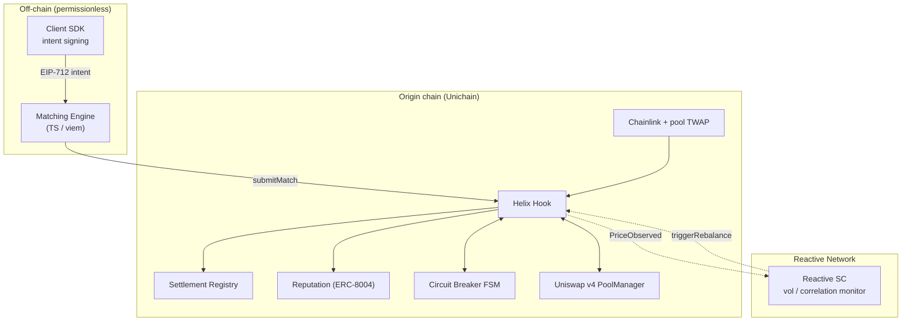

# Helix

**Cross-Pool Hedging Router with Reactive Auto-Rebalancing for Uniswap v4**

Helix is a Uniswap v4 hook that mutualizes impermanent loss (IL) across a matched basket of LP
positions and uses a Reactive Smart Contract (RSC) to autonomously keep each basket's risk profile
valid as markets move. LPs sign an off-chain EIP-712 intent, a permissionless engine pairs them into
baskets, and at settlement the protocol redistributes value so every member converges toward the
basket's **capital-weighted average IL** instead of absorbing its own in full. Redistribution is
**zero-sum within the basket**, **self-funded** from posted margins, and **conservation-preserving by
construction** — enforced as Foundry invariants.

> No external insurance pool · no perp exposure · no exit from the AMM · no privileged operator.

| Component | Status |
| --- | --- |
| Solidity core (hook, registry, reputation, breaker) + RSC | ✅ 28 Foundry tests (unit · fuzz · invariant · integration) + gated fork tests |
| Client SDK (EIP-712 intents, typed client) | ✅ builds · 3 tests |
| Matching engine (correlation + basket optimizer) | ✅ builds · 11 tests · runnable demo |
| Demo frontend (Vite · React · wagmi) | ✅ typecheck · build green |
| CI (Foundry + pnpm workspace) | ✅ `.github/workflows/ci.yml` |

---

## Architecture



Four planes:

- **Liquidity** — canonical Uniswap v4 pools (Helix never moves LP capital).
- **Accounting** — `HelixHook`, `SettlementRegistry`, `ReputationAccumulator` (match state, snapshots, margins, reputation).
- **Control** — `CircuitBreaker` FSM + the `HelixReactive` RSC (when matching / settlement / rebalancing are permitted).
- **Coordination** — off-chain matching engine + SDK (candidate matches + signed intents, no on-chain authority).

---

## Repository layout

```
helix/
├── contracts/            Foundry project (Solidity 0.8.26, v4-core types)
│   ├── src/              hook · registry · reputation · breaker · libraries · reactive · mocks
│   ├── script/Deploy.s.sol
│   └── test/             unit · fuzz · invariant
├── packages/
│   ├── sdk/              @helix/sdk — EIP-712 intents, ABIs, typed HelixClient (viem)
│   └── matching-engine/  @helix/matching-engine — correlation matrix + basket optimizer + CLI
└── apps/
    └── frontend/         @helix/frontend — Vite + React + wagmi dashboard
```

---

## Quickstart

### 1. Contracts

```bash
cd contracts
./setup.sh            # vendors forge-std, v4-core, v4-periphery, openzeppelin, solmate
forge test            # 26 passing: unit, fuzz, invariant
forge script script/Deploy.s.sol      # dry-run: mines a permission-encoding hook address + wires everything
```

### 2. JS workspace (SDK · engine · frontend)

```bash
pnpm install          # installs all workspace packages

# Matching engine — offline demo (no chain needed): correlation matrix + formed baskets
pnpm engine

# Frontend — dashboard (boots in mock mode with zero-address config)
pnpm frontend         # http://localhost:5173

# Tests
pnpm --filter @helix/sdk test
pnpm --filter @helix/matching-engine test
```

Sample matching-engine output:

```
Cross-pool correlation matrix (trailing returns):
                ETH/USDC   WBTC/USD   ARB/USDC
     ETH/USDC       1.00       0.65      -0.44
     WBTC/USD       0.65       1.00      -0.42
     ARB/USDC      -0.44      -0.42       1.00

Formed 3 basket(s):
  Basket 1  pool=ETH/USDC  members=3  variance↓=18.3%  repFloor=0
  ...
```

---

## How it works

**Match → enter → monitor → settle.**

1. **Intent.** An LP signs an EIP-712 `Intent` (`pool`, `maxDriftBps`, `minDuration`, `maxSize`,
   `repFloor`, `nonce`, `deadline`). The SDK handles domain/typing; the on-chain typehash matches exactly.
2. **submitMatch.** Anyone submits a basket of signed intents. The hook re-verifies every signature,
   deadline, nonce, constraint, the breaker state, and the counterparty reputation floor on-chain — a
   malicious engine can only produce matches the hook rejects.
3. **Entry.** Each member's `afterAddLiquidity` snapshots `(x0, y0, P0)`, sizes a settlement margin from
   the basket's worst-case drift, and escrows it in the registry. When all members have entered, the
   epoch opens.
4. **Monitoring.** `afterSwap` updates a pool TWAP accumulator, feeds the volatility circuit breaker, and
   emits `PriceObserved`. The RSC consumes these across chains and dispatches authenticated
   `triggerRebalance` callbacks (PAUSE / RESUME / RE_MATCH).
5. **Settlement.** After the epoch, anyone calls `settle`. The hook cross-checks the Chainlink reference
   against the pool TWAP (reverts on divergence > δ), computes each member's IL, derives the ρ-mutualized
   **zero-sum** adjustment vector, and the registry redistributes between margin accounts, returns
   residual, and pays the caller a bounded settler fee.

### Accounting

For a basket `S` with weights `wᵢ = sizeᵢ/Σsize` and mutualization coefficient `ρ ∈ [0,1]`:

```
ILᵢ          = V_hold(P1) − V_pool(P1)          (CPMM closed form, ≥ 0)
IL_fairᵢ     = wᵢ · Σ ILⱼ
adjustmentᵢ  = ρ · (ILᵢ − IL_fairᵢ)             (worse-than-fair ⇒ receives)
Σ adjustmentᵢ = 0                                (exactly, by construction)
```

Effective IL becomes `(1−ρ)·ILᵢ + ρ·IL_fairᵢ` — the basket average at `ρ = 1`, your own outcome at
`ρ = 0`. Because the adjustments net to zero, redistribution is self-funded and the registry can never
pay out more than it escrows.

---

## Enforced invariants (Foundry)

| Invariant | Test |
| --- | --- |
| **Conservation** — `Σ payouts ≤ Σ margins (+ surplus)` | `test/invariant` (16 384 calls), `test/fuzz` (512 runs), `test/unit/HelixFlow` |
| **Zero-sum** — `Σ adjustments == 0` exactly, all inputs | `test/unit/MathUnit` (fuzz) |
| **Margin solvency** — escrow backs every live obligation | `test/invariant` |
| **Settlement idempotency** — `SETTLED` cannot re-settle | `test/invariant`, `test/unit/HelixFlow` |
| **Oracle resistance** — revert on Chainlink↔TWAP divergence | `test/unit/ControlPlane` |
| **Breaker hysteresis** — separate entry/exit thresholds, RSC-gated resume | `test/unit/ControlPlane` |
| **RSC authentication** — `triggerRebalance` only from the registered proxy | `test/unit/ControlPlane` |
| **Reactive loop (E2E)** — hook's real events → RSC → real callback bytes → hook pauses/resumes | `test/integration/ReactiveLoop` |

---

## Design decisions

- **v4-core types only.** The hook compiles against stable `v4-core` interfaces/libraries; the heavy
  `PoolManager` is never compiled. Tests drive the hook callbacks through a faithful `extsload`-backed
  `MockPoolManager`, so builds are fast and deterministic and there's no `v4-periphery` version churn
  (a minimal `BaseHook` is vendored). The deploy script mines a real permission-encoding CREATE2 address.
- **WAD accounting with token scaling.** Margins are tracked in WAD; the registry converts to the token
  at transfer boundaries with `scale = 10^(18−decimals)`, always rounding payouts **down** so out ≤ in.
  With an 18-decimal value token, conservation is exact.
- **CPMM IL model.** Each position is modeled as a 50/50 constant-product LP — a well-defined, monotone,
  gas-cheap baseline used purely for *relative* redistribution inside a basket.
- **RSC vendored interface.** `HelixReactive` targets the Reactive Network SDK via a minimal vendored
  surface (`ReactiveLib`), so its vol/correlation logic is unit-tested locally; swap the import for
  `@reactivenetwork/reactive-lib` at deploy time.

---

## Tech stack

| Layer | Choice |
| --- | --- |
| Contracts | Solidity 0.8.26, Uniswap v4-core, OpenZeppelin v5, solmate |
| Build & test | Foundry (forge) — invariant + fuzz suites |
| Price data | Chainlink reference + Uniswap v4 pool TWAP cross-check |
| Automation | Reactive Network RSC |
| Reputation | ERC-8004-aligned registry |
| Intents | EIP-712 typed-data signatures |
| Engine / SDK | TypeScript, viem |
| Frontend | Vite + React + TypeScript, wagmi + viem |

---

## License

MIT
