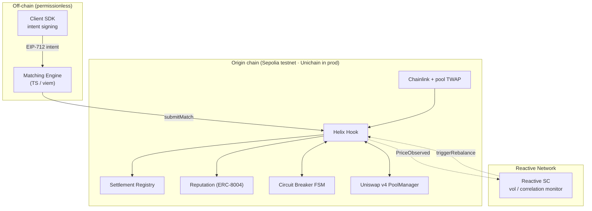

# Helix

**Cross-Pool Hedging Router with Reactive Auto-Rebalancing for Uniswap v4**

Helix is a Uniswap v4 hook that mutualizes impermanent loss (IL) across a matched basket of LP
positions and uses a Reactive Smart Contract (RSC) to autonomously keep each basket's risk profile
valid as markets move. LPs sign an off-chain EIP-712 intent, a permissionless engine pairs them into
baskets, and at settlement the protocol redistributes value so every member converges toward the
basket's **capital-weighted average IL** instead of absorbing its own in full. Redistribution is
**zero-sum within the basket**, **self-funded** from posted margins, and **conservation-preserving by
construction** — enforced as Foundry invariants.

> No external insurance pool · no perp exposure · no exit from the AMM · no privileged operator.

| Component | Status |
| --- | --- |
| Solidity core (hook, registry, reputation, breaker) + RSC | ✅ 41 Foundry tests (unit · fuzz · invariant · integration) + gated fork tests |
| Client SDK (EIP-712 intents, typed client) | ✅ builds · 3 tests |
| Matching engine (correlation + cross-pool optimizer + Monte-Carlo) | ✅ builds · 16 tests · runnable demo |
| Demo frontend (Vite · React · wagmi) | ✅ typecheck · build green |
| CI (Foundry + pnpm workspace) | ✅ `.github/workflows/ci.yml` |
| Live deployment | ✅ Sepolia, all contracts source-verified on Sourcify |
| Real Uniswap v4 integration | ✅ full lifecycle (init → add-liquidity → swap → settle) against the canonical Sepolia v4 `PoolManager` (fork test) |

---

## Live on Sepolia (chainId 11155111)

All contracts are deployed and **source-verified on [Sourcify](https://sourcify.dev)**. The hook owner is
the deployer (admin functions live).

| Contract | Address |
| --- | --- |
| **HelixHook** | [`0x0E00cAc14C70Cf2EA46b33fe17E55Ac02DEb5640`](https://sepolia.etherscan.io/address/0x0E00cAc14C70Cf2EA46b33fe17E55Ac02DEb5640) |
| SettlementRegistry | [`0x8f450Fc17Fa1f84d8b69bC9816C543be503C8195`](https://sepolia.etherscan.io/address/0x8f450Fc17Fa1f84d8b69bC9816C543be503C8195) |
| ReputationAccumulator | [`0x7584Ec7599c39600b92d663B95fD1887ee48D87D`](https://sepolia.etherscan.io/address/0x7584Ec7599c39600b92d663B95fD1887ee48D87D) |
| CircuitBreaker | [`0x7FBB5B8D97F1B562C7e2b1fDD30A3BEFBc7fBdf2`](https://sepolia.etherscan.io/address/0x7FBB5B8D97F1B562C7e2b1fDD30A3BEFBc7fBdf2) |
| MockOracle | [`0x3334aeA99e7B838bCecb7b3931245052639D4599`](https://sepolia.etherscan.io/address/0x3334aeA99e7B838bCecb7b3931245052639D4599) |
| Value token (USDV, 18-dec) | [`0x15cc1B894b3A3a668211B43172Ce034E2D7d5BAD`](https://sepolia.etherscan.io/address/0x15cc1B894b3A3a668211B43172Ce034E2D7d5BAD) |
| MockPoolManager | [`0x1259f0e1D2EB8152966b85318c0a71CeD258e692`](https://sepolia.etherscan.io/address/0x1259f0e1D2EB8152966b85318c0a71CeD258e692) |
| **ChainlinkOracle** (live ETH/USD) | [`0xf9D3cf14158a9F7afC463752F5290369Ef101D66`](https://sepolia.etherscan.io/address/0xf9D3cf14158a9F7afC463752F5290369Ef101D66) → reads the real [Chainlink ETH/USD feed](https://sepolia.etherscan.io/address/0x694AA1769357215DE4FAC081bf1f309aDC325306) (`price()` = live ETH price in WAD) |

A live, permissionless **`submitMatch`** formed a 2-LP basket on-chain:
[tx `0x35554f…`](https://sepolia.etherscan.io/tx/0x35554f84611091df678840440a0d5b3597c970dac1242657488960434f971b1d)
(matchId `0xfcbc99…a7a0`, demo pool `0xc5c1d5…da2e5`). Full record, config and tx hashes in
[`deployments/sepolia.json`](deployments/sepolia.json). A copy-paste UI brief for Lovable/v0 is in
[`docs/LOVABLE_PROMPT.md`](docs/LOVABLE_PROMPT.md).

> The live addresses above are the single-pool build; the cross-pool upgrade is on `main` and proven
> against the real v4 PoolManager by the fork test — redeploy with `script/Deploy.s.sol` to publish it.

---

## Seeing it work

**The value loop, with real numbers** (`forge test --match-contract Showcase -vv`): three LPs in one pool
enter at very different prices, so their impermanent loss is wildly dispersed — then ρ-mutualization
converges every one of them to the basket's capital-weighted average, conservation-checked on-chain:

```
LP      entryPx   standalone IL rate      after ρ=100%
alice   1.00      45 bps  (0.45%)         602 bps
bob     2.00      254 bps (2.54%)    →    602 bps
carol   0.50      1508 bps (15.08%)       602 bps
IL-rate variance:  417396  →  0     (100% reduction)
on-chain settle: payouts == margins  (conservation holds)
```

**Against the real Uniswap v4 PoolManager** (`FORK_RPC_URL=<sepolia> forge test --match-test test_fork_fullLifecycleAgainstRealV4 -vv`):
forks Sepolia and runs the complete loop — `initialize` → real `afterAddLiquidity` entry → real swap
(`afterSwap`/TWAP) → `settle` — against the canonical v4 `PoolManager` at `0xE03A1074…3543`. The hook is
load-bearing on actual Uniswap, not a mock.

---

## Architecture



Four planes:

- **Liquidity** — canonical Uniswap v4 pools (Helix never moves LP capital).
- **Accounting** — `HelixHook`, `SettlementRegistry`, `ReputationAccumulator` (match state, snapshots, margins, reputation).
- **Control** — `CircuitBreaker` FSM + the `HelixReactive` RSC (when matching / settlement / rebalancing are permitted).
- **Coordination** — off-chain matching engine + SDK (candidate matches + signed intents, no on-chain authority).

---

## Repository layout

```
helix/
├── contracts/            Foundry project (Solidity 0.8.26, v4-core types)
│   ├── src/              hook · registry · reputation · breaker · libraries · reactive · mocks
│   ├── script/Deploy.s.sol
│   └── test/             unit · fuzz · invariant · integration · fork
├── packages/
│   ├── sdk/              @helix/sdk — EIP-712 intents, ABIs, typed HelixClient (viem)
│   └── matching-engine/  @helix/matching-engine — correlation matrix + basket optimizer + CLI
└── apps/
    └── frontend/         @helix/frontend — Vite + React + wagmi dashboard
```

---

## Quickstart

### 1. Contracts

```bash
cd contracts
./setup.sh            # vendors forge-std, v4-core, v4-periphery, openzeppelin, solmate
forge test            # 41 passing + 3 fork (gated)
forge script script/Deploy.s.sol      # dry-run: mines a permission-encoding hook address + wires everything
```

### 2. JS workspace (SDK · engine · frontend)

```bash
pnpm install          # installs all workspace packages

# Matching engine — offline demo (no chain needed): correlation matrix + formed baskets
pnpm engine

# Frontend — dashboard (boots in mock mode with zero-address config)
pnpm frontend         # http://localhost:5173

# Tests
pnpm --filter @helix/sdk test
pnpm --filter @helix/matching-engine test
```

Sample matching-engine output:

```
Cross-pool correlation matrix (trailing returns):
                ETH/USDC   WBTC/USD   ARB/USDC
     ETH/USDC       1.00       0.65      -0.44
     WBTC/USD       0.65       1.00      -0.42
     ARB/USDC      -0.44      -0.42       1.00

Cross-pool baskets (correlation-diversified, hedging across assets):
  Basket 1:  ETH/USDC  +  ARB/USDC    div-score=46.8  (anti-correlated → strong hedge)
  Basket 2:  WBTC/USDC +  ARB/USDC    div-score=46.2
  Basket 3:  ETH/USDC  +  WBTC/USDC   div-score=2.9   (correlated → weak)

Monte-Carlo: measured IL-variance reduction (5000 scenarios, σ=0.40)
  ρ=0.50  →  ex-ante IL variance falls 40%  (ex-post per slot: 44%, 16%)
  ρ=1.00  →  ex-ante IL variance falls 54%  (ex-post per slot: 73%, -61%)
```

> **Why an LP opts in (the insurance thesis).** *Ex-ante* — before you know whether you'll be the
> well-timed or the unlucky LP — pooling cuts your expected IL variance (40–54% above). *Ex-post* it's
> zero-sum: some slots win, some pay. At moderate ρ the trade is Pareto-improving for both slots
> (ρ=0.5 → 44% / 16%); ρ keeps skin in the game. This is measured, not assumed (`simulate.ts`).

---

## How it works

**Match → enter → monitor → settle.**

1. **Intent.** An LP signs an EIP-712 `Intent` (`pool`, `maxDriftBps`, `minDuration`, `maxSize`,
   `repFloor`, `nonce`, `deadline`). The SDK handles domain/typing; the on-chain typehash matches exactly.
2. **submitMatch.** Anyone submits a basket of signed intents. The hook re-verifies every signature,
   deadline, nonce, constraint, the breaker state, and the counterparty reputation floor on-chain — a
   malicious engine can only produce matches the hook rejects.
3. **Entry.** Each member's `afterAddLiquidity` snapshots `(x0, y0, P0)`, sizes a settlement margin from
   the basket's worst-case drift, and escrows it in the registry. When all members have entered, the
   epoch opens.
4. **Monitoring.** `afterSwap` updates a pool TWAP accumulator, feeds the volatility circuit breaker, and
   emits `PriceObserved`. The RSC consumes these across chains and dispatches authenticated
   `triggerRebalance` callbacks (PAUSE / RESUME / RE_MATCH).
5. **Settlement.** After the epoch, anyone calls `settle`. The hook cross-checks the Chainlink reference
   against the pool TWAP (reverts on divergence > δ), computes each member's IL, derives the ρ-mutualized
   **zero-sum** adjustment vector, and the registry redistributes between margin accounts, returns
   residual, and pays the caller a bounded settler fee.

### Accounting

For a basket `S` with weights `wᵢ = sizeᵢ/Σsize` and mutualization coefficient `ρ ∈ [0,1]`:

```
ILᵢ          = V_hold(P1) − V_pool(P1)          (CPMM closed form, ≥ 0)
IL_fairᵢ     = wᵢ · Σ ILⱼ
adjustmentᵢ  = ρ · (ILᵢ − IL_fairᵢ)             (worse-than-fair ⇒ receives)
Σ adjustmentᵢ = 0                                (exactly, by construction)
```

Effective IL becomes `(1−ρ)·ILᵢ + ρ·IL_fairᵢ` — the basket average at `ρ = 1`, your own outcome at
`ρ = 0`. Because the adjustments net to zero, redistribution is self-funded and the registry can never
pay out more than it escrows.

---

## Enforced invariants (Foundry)

| Invariant | Test |
| --- | --- |
| **Conservation** — `Σ payouts ≤ Σ margins (+ surplus)` | `test/invariant` (16 384 calls), `test/fuzz` (2 000 runs), `test/unit/HelixFlow` |
| **Settlement solvency** — ρ is bounded to posted margins so `settle()` never under-funds a member (zero-sum preserved; ρ only eases in extreme drift) | `test/fuzz` (worst-corner + fuzz) |
| **Zero-sum** — `Σ adjustments == 0` exactly, all inputs | `test/unit/MathUnit` (fuzz) |
| **Margin solvency** — escrow backs every live obligation | `test/invariant` |
| **Settlement idempotency** — `SETTLED` cannot re-settle | `test/invariant`, `test/unit/HelixFlow` |
| **Oracle resistance** — revert on Chainlink↔TWAP divergence | `test/unit/ControlPlane` |
| **Breaker hysteresis** — separate entry/exit thresholds, RSC-gated resume | `test/unit/ControlPlane` |
| **RSC authentication** — `triggerRebalance` only from the registered proxy | `test/unit/ControlPlane` |
| **Reactive loop (E2E)** — hook's real events → RSC → real callback bytes → hook pauses/resumes | `test/integration/ReactiveLoop` |

---

## Design decisions

- **v4-core types only.** The hook compiles against stable `v4-core` interfaces/libraries; the heavy
  `PoolManager` is never compiled. Tests drive the hook callbacks through a faithful `extsload`-backed
  `MockPoolManager`, so builds are fast and deterministic and there's no `v4-periphery` version churn
  (a minimal `BaseHook` is vendored). The deploy script mines a real permission-encoding CREATE2 address.
- **WAD accounting with token scaling.** Margins are tracked in WAD; the registry converts to the token
  at transfer boundaries with `scale = 10^(18−decimals)`, always rounding payouts **down** so out ≤ in.
  With an 18-decimal value token, conservation is exact.
- **CPMM IL model.** Each position is modeled as a 50/50 constant-product LP — a well-defined, monotone,
  gas-cheap baseline used purely for *relative* redistribution inside a basket.
- **RSC vendored interface.** `HelixReactive` targets the Reactive Network SDK via a minimal vendored
  surface (`ReactiveLib`), so its vol/correlation logic is unit-tested locally; swap the import for
  `@reactivenetwork/reactive-lib` at deploy time.

### Scope (what's real today vs roadmap)

- **Cross-pool baskets are live.** A basket can span multiple pools (different assets); each member is
  priced at its *own* pool (oracle cross-checked vs that pool's TWAP), and mutualization runs over the
  combined IL vector (`test/unit/CrossPool.t.sol`). The matching engine *uses* the correlation matrix to
  pair anti-correlated pools (`formCrossPoolBaskets`: ARB↔ETH score ~47 vs ETH↔WBTC ~3). Cross-*chain*
  (CCTP) coordination of such baskets is the remaining roadmap item.
- **IL model is full-range CPMM**, a clean baseline for *relative* redistribution. A
  concentrated-liquidity-aware IL (and a fees term) is a planned refinement; the fork lifecycle already
  runs on real concentrated v4 positions and snapshots their actual token composition.
- **Cross-chain (CCTP)** and **deploying the RSC to Reactive Network** are specified and locally
  simulated; they are not yet live.

---

## Tech stack

| Layer | Choice |
| --- | --- |
| Contracts | Solidity 0.8.26, Uniswap v4-core, OpenZeppelin v5, solmate |
| Build & test | Foundry (forge) — invariant + fuzz suites |
| Price data | Chainlink reference + Uniswap v4 pool TWAP cross-check |
| Automation | Reactive Network RSC |
| Reputation | ERC-8004-aligned registry |
| Intents | EIP-712 typed-data signatures |
| Engine / SDK | TypeScript, viem |
| Frontend | Vite + React + TypeScript, wagmi + viem |

---

## License

MIT
